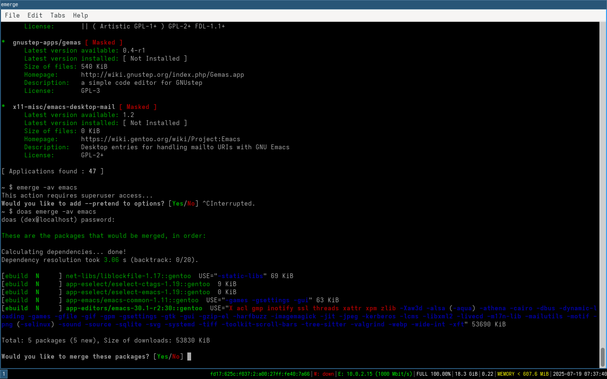

# Bedrock Linux

Bedrock Linux es una distribucion de linux que permite mezclar diferentes distribuciones de linux, por ejemplo, puedes usar el gestor de paquetes de debian y el kernel de arch, o el gestor de paquetes de arch y el kernel de debian, etc.

y vamos a probar su instalacion y configuracion la cual es bastante sencilla y rapida, y ademas es una distribucion que no requiere de mucho hardware para funcionar.

## Requisitos minimos

Para instalar Bedrock Linux, los requisitos minimos son:
- Un procesador de 64 bits
- 1 GB de RAM
- 10 GB de espacio en disco

## Instalacion

a continuacion vamos a ver como instalar Bedrock Linux, para ello vamos a usar una maquina virtual con VirtualBox, pero puedes usar cualquier otra herramienta de virtualizacion.
en esta maquina virtual vamos a instalar una distribucion de linux base, en este caso vamos a usar alpine linux que es un a version muy ligera de linux, pero puedes usar cualquier otra distribucion de linux.


![[programas minimos]](../images/brl/1.png)

en la imagen anterior vemos los programas minimos que necesitamo para tener escritorio en alpine linux.
en este caso vamos a instalar i3wm como gestor de ventanas.

en la siguiente imagen se descarga el script de instalacion de bedrock linux, el cual es muy sencillo y rapido de ejecutar.
para mas informacion https://bedrocklinux.org/


como pueden ver, el script de instalacion es muy sencillo y rapido de ejecutar, solo hay que seguir las instrucciones que aparecen en pantalla.
pero antes debes tener permisos de root en este caso usare doas que es como sudo pero mas ligero y rapido, si no lo tienes instalado puedes instalarlo con el siguiente comando:

```bash
apk add doas
```

y luego debes configurar el archivo /etc/doas.conf para que puedas usarlo sin contraseña, para ello debes agregar la siguiente linea:

```bash
doas sh bedrock-linux-installer.sh
```


para instalar bedrock linux, solo hay que ejecutar el script de instalacion y seguir las instrucciones una de ellas es
escribir Not reversible! para confirmar que quieres instalar bedrock linux, y luego te pedira que reinicies la maquina virtual o pc para que los cambios surtan efecto.

una bez instalado bedrock linux, puedes usar el comando `brl` para ver las distribuciones de linux que tienes instaladas, en este caso solo tenemos alpine linux y bedrock linux.

por lo que instalare gentoo sobre este alpine linux, para ello usaremos el comando `brl install gentoo` y seguiremos las instrucciones que aparecen en pantalla.


 aqui en la imagen puedes ver como se instala gentoo sobre alpine linux, y luego de instalarlo puedes usar el comando `brl` para ver las distribuciones de linux que tienes instaladas, en este caso tenemos alpine linux y gentoo.

 y con emerge instalamos emacs y tambien instalamos neofetch que no esta en alpine linux por defecto




tipico gentoo instalando un paquete, pero no te preocupes, esto es normal en gentoo, ya que es una distribucion que se compila desde el codigo fuente, por lo que puede tardar un poco mas en instalar los paquetes.


aqui vemos como se ve emacs en gentoo, y como pueden ver, es muy similar a emacs en cualquier otra distribucion de linux, ya que es el mismo programa


y aqui vemos como se ve neofetch en bedrock linux, y como pueden ver, es muy similar a neofetch en cualquier otra distribucion de linux, ya que es el mismo programa.
nos muestra los paquetes en alpine y en gentoo 


## conclusiones

Bedrock Linux es una distribucion de linux muy interesante, ya que permite mezclar diferentes distribuciones de linux, lo que te permite tener lo mejor de cada una de ellas.
ademas, su instalacion y configuracion es muy sencilla y rapida, y no requiere de mucho hardware para funcionar.
es una distribucion que vale la pena probar, y si te gusta, puedes usarla como tu distribucion principal de linux.
ademas, es una distribucion que te permite aprender mucho sobre linux, ya que te obliga a conocer un poco mas sobre las diferentes distribuciones de linux y sus gestores de paquetes.
en mi caso, me gusta mucho bedrock linux, ya que me permite usar lo mejor de cada distribucion de linux, y ademas es muy ligera y rapida, lo que la hace ideal para usar en una maquina virtual o en un equipo con pocos recursos.
eso si en maquina virtual fijate que el disco sea de al menos 20 GB y sin rezise dinamico para que no tengas problemas al instalar gentoo

lo mejor de es que puesdes usar como base cualquier distribucion de linux, ya que bedrock linux es una capa que se instala sobre la distribucion base, me recuerda a nixos aunque no es lo mismo, ya que nixos es una distribucion que se basa en el gestor de paquetes nix, mientras que bedrock linux es una distribucion que se basa en la mezcla de diferentes distribuciones de linux.
en resumen, bedrock linux es una distribucion de linux que vale la pena probar, y si te gusta, puedes usarla como tu distribucion principal de linux.